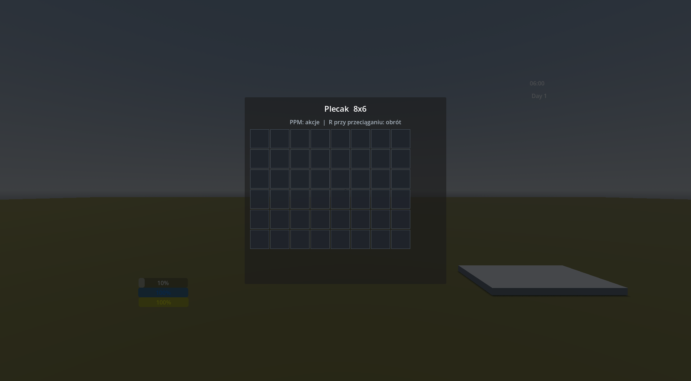

# SACRUM

**A narrative-first, first-person survival RPG set in the 1990s.**

SACRUM is an early-stage game prototype built around uncertainty, observation, and player experimentation. It deliberately avoids quest markers, recipe lists, and intrusive tutorials: the player is expected to learn the world through dialogue, environmental clues, failed attempts, and physical interaction.

## Design pillars

- **No hand-holding** — information must be discovered rather than delivered by HUD prompts.
- **Narrative survival** — dialogue and story are central, not an interruption between survival systems.
- **Unknown recipes** — crafting is based on physically combining items and understanding their properties.
- **Meaningful difficulty** — scarcity, stamina, needs, and imperfect knowledge create pressure.
- **Tactile interaction** — objects can be lifted, moved, rotated, stored, dropped, and used in the world.

## Current prototype

The project currently includes:

- first-person movement, sprinting, crouching, stamina, head bob, and camera collision;
- physics-based item handling for light and heavy objects;
- hunger, thirst, health, sanity, sleep, and a day/time cycle;
- physical crafting stations and a deployable crafting tarp;
- an original grid-based backpack with stacking, rotation, drag-and-drop, item use, and deployment;
- contextual interaction UI, main menu, settings, and pause menu;
- dialogue foundations powered by Dialogic.

The inventory architecture is implemented directly in GDScript and no longer depends on an external inventory framework. Item definitions, stacks, placement rules, world interactions, and UI are separated into focused components so the system can evolve without coupling gameplay to one screen.

## Development and prompt engineering

SACRUM is also an experiment in combining conventional software engineering with deliberate prompt engineering. AI-assisted workflows are used to explore architecture, challenge implementation decisions, design smoke tests, and improve documentation, while the resulting code and gameplay behavior are reviewed and validated inside Godot.

Prompt engineering does not replace authorship or technical judgment in this project; it is treated as an iterative development tool. The goal is to learn how clear constraints, reproducible tests, and critical evaluation can turn model output into maintainable GDScript systems.

## Technology

- **Engine:** Godot 4.6
- **Language:** GDScript
- **Rendering:** Forward+
- **Dialogue:** Dialogic
- **Target platform:** Windows

## Controls

| Action | Input |
| --- | --- |
| Move | `WASD` |
| Jump | `Space` |
| Sprint | `Shift` |
| Crouch | `Ctrl` |
| Interact / pick up | Left mouse button |
| Throw held item | Middle mouse button |
| Store world item | `F` |
| Open backpack | `I` |
| Rotate inventory item | `R` while dragging |
| Rotate deployable | `Q` |
| Pause | `Esc` |

## Running the project

1. Install Godot **4.6.3** or a compatible Godot 4.6 release.
2. Clone this repository.
3. Import `project.godot` in Godot.
4. Run the project with `F6`/`F5`.

## Project status

SACRUM is a work in progress. The current repository documents active systems and technical experimentation rather than a finished or commercially released game.
